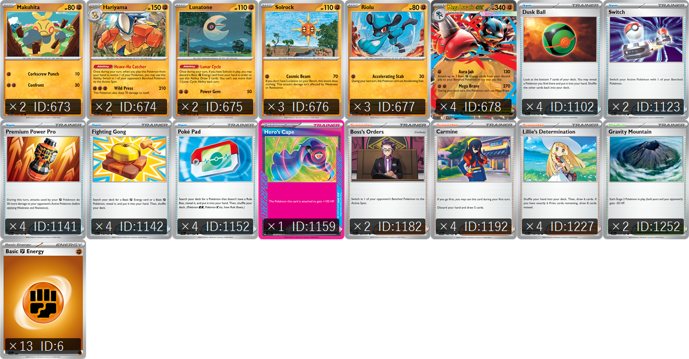
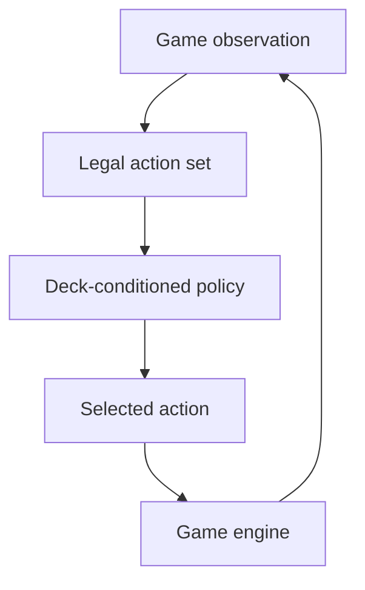
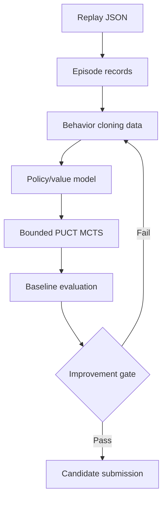

# Pokémon TCG AI Battle

An AI player for the **[The Pokémon Company – PTCG AI Battle Challenge Simulation](https://www.kaggle.com/competitions/pokemon-tcg-ai-battle)**.

**Competition host:** The Pokémon Company – PTCGABC Team

The project combines a Mega Lucario ex deck-specific decision agent with local
self-play evaluation, reproducible submission tooling, and replay-based strategy
analysis.

**Current status:** the submitted policy is a rule-based heuristic agent. The replay
learning, transformer policy/value model, and PUCT-MCTS components are research tools
for candidate development; they are not currently part of the production submission.



## Featured Kaggle notebook

[**A Sample Rule-Based Agent — Mega Lucario ex Deck**](https://www.kaggle.com/code/kiyotah/a-sample-rule-based-agent-mega-lucario-ex-deck)

The live Kaggle notebook provides the hosted reference implementation and competition context.

## Technical approach

The agent operates in a **partially observable stochastic environment**: the opponent's
private state is hidden, while shuffles, draws, and game effects introduce transition
uncertainty. The deployed policy is currently a deck-conditioned heuristic policy that
maps an observation and legal action set to a ranked action selection.

The research pipeline supports this baseline with:

- **Offline replay analysis and behavior cloning:** public trajectories are converted
  into observation–action–outcome records, with episode-level separation reserved for
  leakage-resistant evaluation.
- **Policy/value approximation:** the optional transformer model estimates action
  preferences and state value using sparse card, board, player-state, and candidate-action
  features.
- **PUCT-style Monte Carlo Tree Search:** the policy supplies priors while the value
  function evaluates expanded states; bounded legal-action enumeration controls the
  branching factor.
- **Empirical evaluation:** local self-play, per-seat win rates, matchup breakdowns,
  and confidence intervals are used to distinguish signal from stochastic variance.

The neural MCTS path is an experimental research component and is not promoted to the
submitted policy until it exceeds the heuristic baseline under controlled evaluation.

## Development roadmap

The project follows a staged promotion process. Each phase must produce measurable
evidence before the next policy change is submitted.

| Phase | Focus | Promotion gate |
|---|---|---|
| **1. Correctness and observability** | Context-aware optional selections, fallback telemetry, replay alignment, and tactical regression fixtures. | Zero fallback activations in a large local evaluation; all returned actions legal. |
| **2. Tactical intelligence** | Immediate-win checks, knockout thresholds, prize-race features, retreat risk, and state-dependent Trainer/Ability/Evolution decisions. | Improved per-seat and matchup results without a severe regression. |
| **3. Opponent league evaluation** | Frozen baseline, previous submissions, mirror, and replay-mined archetype opponents. | Confidence intervals clear the baseline with no critical matchup collapse. |
| **4. Replay learning** | Same-deck expert filtering, decision-difference audits, and legal-action behavior cloning. | Held-out episode agreement and win rate improve over the heuristic policy. |
| **5. Focused search and value learning** | Policy/value modeling, plausible opponent replies, and narrow two-ply PUCT search. | Search improves the trained baseline under latency and reliability limits. |

### Current decision

The current priority is **Phase 1**. The latest lower Kaggle score should be treated as
an evaluation signal, not proof that a particular heuristic is better or worse. Another
submission should wait until optional-selection behavior and fallback counts have been
tested locally against the opponent league.

### Decision loop



### Research pipeline



Mobile-friendly SVG exports are available here:

- [Decision loop SVG](docs/diagrams/decision-loop.svg)
- [Research pipeline SVG](docs/diagrams/research-pipeline.svg)

## What's here

| Path | What it is |
|------|------------|
| `submission/main.py` | The agent — a deck-specific heuristic scorer (currently **Mega Lucario ex**). |
| `submission/deck.csv` | The 60-card deck the agent plays. |
| `submission/cg/` | The competition game engine (Linux `.so` + Python API). |
| `tools/run_match.py` | Runs N local battles (our agent vs random) and reports win rate. |
| `tools/test_local.sh` | Wraps the runner in a Linux Docker container (the engine can't load on macOS). |
| `tools/mcts_adapter.py` | Engine-independent bounded MCTS and model interface based on the Kaggle sample. |
| `tools/scout_public_code.py` | Ranks and downloads public competition notebooks for code-pattern analysis. |
| `tools/replay_diagnostics.py` | Pure-Python replay reports: matchup/context stats, same-deck filtering, and heuristic/public action comparison. |
| `notebooks/kaggle_player_band_harvest.ipynb` | Compares replay-derived behavior across leaderboard performance bands. |
| `notebooks/kaggle_score_monitor.ipynb` | Tracks public submission scores, leaderboard movement, and research signals over time. |
| `notebooks/kaggle_submission_diagnostics.ipynb` | Connects Kaggle outcomes to local commits, archive hashes, and validation evidence. |
| `notebooks/kaggle_episode_replay_analysis.ipynb` | Reads episode JSON to compare wins, losses, seats, opponents, turns, and action patterns. |
| `reports/submission_55443071_replay_review.md` | Replay-based review of the latest high-scoring submission. |
| `notebooks/kaggle_submit.ipynb` | Validates, packages, and optionally submits the current agent to Kaggle. |
| `sample_submission/` | The original untouched template from the competition. |
| `EN_Card_Data.csv`, `JP_Card_Data.csv` | Card reference data. |

Not tracked in git (see `.gitignore`): secrets (`.env`, `kaggle.json`), the large card PDFs, and downloaded Kaggle artifacts (`kaggle_code/`, `rl_mcts_test/`).

### Replay diagnostics (issues 6–9)

The portable diagnostics tool does not import the game engine or production agent:

```bash
python tools/replay_diagnostics.py episodes.json --deck submission/deck.csv \
  --deck-mode similarity --threshold .9 --format markdown -o replay.md
python tools/replay_diagnostics.py normalized.csv --format csv
```

It groups wins/losses and action agreement by opponent, team, archetype, seat, and
selection context. Deck matching is a card-count (multiset) exact match or configurable
Jaccard overlap. An optional `--callback module:function` receives `(observation,
legal_actions)` for heuristic comparison; without it, the tool compares explicitly
recorded `heuristic_action`/`agent_action` candidates and otherwise reports the replay
action as the offline baseline. Observation/action transitions are aligned only within
the same or immediately following replay cell, and ambiguous cells are skipped.

## How an agent works

`agent(obs_dict)` is called every time the engine needs a decision:

- **First call** (`obs.select is None`): return your 60-card deck (list of card IDs).
- **Every other call**: the engine offers `obs.select.option` (a list of legal choices —
  play a card, attach energy, attack, retreat, etc.). Return a list of option **indices**,
  length between `minCount` and `maxCount`, no duplicates.

The strong agents score every option with hand-tuned, deck-specific rules and pick the
highest-scoring ones. See `submission/cg/api.py` for the full `Observation` structure.

## Testing locally

Requires Docker Desktop running (the engine is a Linux x86-64 `.so`; it's emulated on
Apple Silicon — slower but works). All args pass through to `tools/run_match.py`.

```bash
./tools/test_local.sh                              # submission vs random, 20 games
./tools/test_local.sh --a submission --b random  -n 30
./tools/test_local.sh --a submission --b baseline -n 40   # head-to-head vs the frozen baseline
```

- `baseline/` is a frozen snapshot of the original sample agent. When you improve
  `submission/`, run it against `baseline` to measure whether the change actually helps.
- Output reports **per-seat** win rate. This matters: going first is a big advantage in
  this game (the sample beats random ~100% as P0 but ~60% as P1), so always judge a
  change by its per-seat numbers, not the blended total.

### Evaluation methodology

The evaluation harness uses independent Docker workers and reports per-seat win rates
with **95% confidence intervals**. This reduces the risk of interpreting random draws,
first-player advantage, or matchup variance as a genuine policy improvement.

## Submitting to Kaggle

See [SUBMITTING.md](SUBMITTING.md). In short: a Kaggle notebook packages
`main.py` + `deck.csv` + the `cg` engine into `submission.tar.gz`, then you click
**Submit Agent** on the competition page.
