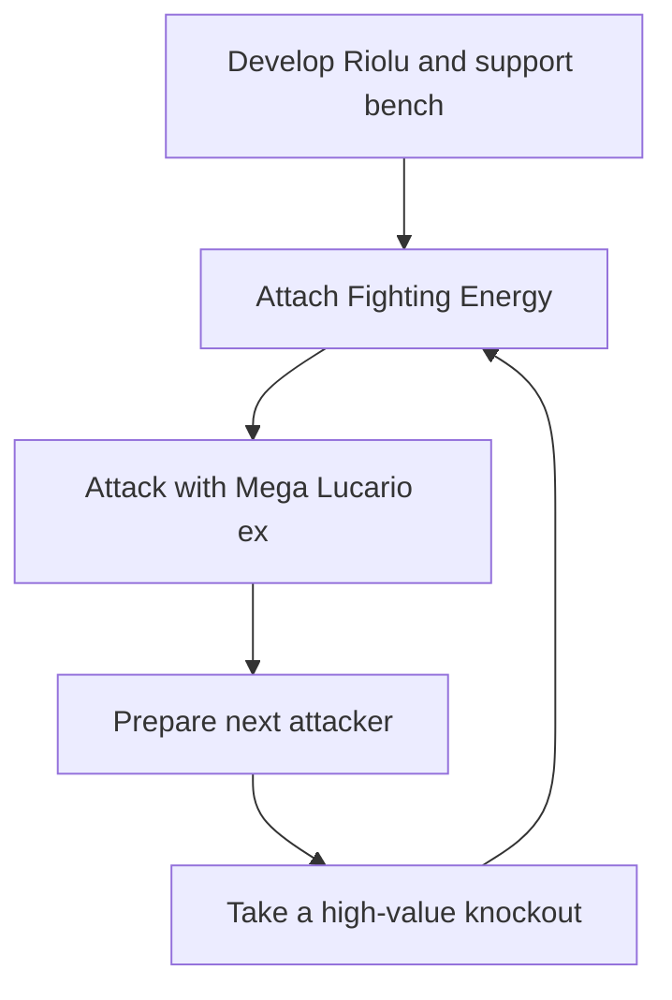

# Turning Hidden Information into a Prize Race

## A transparent Mega Lucario ex agent for the Pokémon TCG AI Battle Challenge

### Abstract

This project treats Pokémon TCG play as sequential decision-making under partial observability. The agent does not know the opponent’s hand, deck order, or face-down Prizes. It therefore combines a deck-specific heuristic policy with legal-action filtering, tactical target selection, and replay-based evaluation. The central objective is not to maximize damage on the current action. It is to create a reliable path through the Prize race: establish an attacker, preserve the next turn’s energy economy, and take the highest-value knockout that is actually available.

The current production agent is intentionally interpretable. Every decision is made by scoring the legal options in the current observation. Experimental policy/value models and bounded search remain separate research tracks; they have not replaced the submitted heuristic.

## Deck concept

The deck is built around four Mega Lucario ex and three Riolu. Mega Lucario ex provides the primary damage plan: Aura Jab deals 130 damage while attaching Fighting Energy from the discard to Benched Pokémon, and Mega Brave deals 270 damage for two Fighting Energy with a one-turn usage restriction. The deck is designed to turn one attack into the next attacker’s preparation rather than treating attacks as isolated events.

The supporting Pokémon give the deck alternate tempo lines:

- **Makuhita/Hariyama:** a secondary Fighting attacker. Hariyama can also switch an opponent’s Benched Pokémon Active when it evolves, creating a gust effect without spending Boss’s Orders.
- **Solrock/Lunatone:** a setup and draw package. Solrock is a conditional attacker when Lunatone is Benched, while Lunatone converts discarded Fighting Energy into additional cards.
- **Dusk Ball:** searches the Pokémon lines needed for the current board state.
- **Fighting Gong and Premium Power Pro:** provide tactical energy and damage support.
- **Carmine and Lillie’s Determination:** maintain hand quality and recover from poor openings.
- **Boss’s Orders and Switch:** convert a prepared attacker into a targeted knockout or preserve a damaged Active Pokémon.
- **Hero Cape and Gravity Mountain:** alter survival and damage thresholds when the Prize race requires it.

The deck’s basic loop is:

## Decision policy

The agent receives an observation and a legal action set. On the initial call it returns the fixed 60-card deck. On later calls it converts the observation into typed game objects and scores every legal option.

The policy tracks a small tactical plan containing:

- Candidate attacker and attack slot
- Candidate opponent target
- Remaining target HP after the attack
- Whether an energy attachment is required
- Whether a switch, retreat, evolution, ability, or gust action is legal
- Whether a Lunatone ability has already been used during the turn

The target planner accounts for Pokémon Prize value, HP, attached Energy, Tools, weakness, resistance, and whether the attack can actually reach the target. A Benched target is considered reachable only when an appropriate effect is legal, including Boss’s Orders or Hariyama’s evolution ability. The action scorer then combines this tactical plan with immediate board facts such as hand counts, current attachments, bench space, supporter usage, and available attacks.

This separation is important. A theoretically strong future line must not outrank an action that is legal now but cannot be completed. Conversely, a currently legal attack that wins the game should outrank draw, evolution, or setup actions. All returned indices are constrained to the offered legal options, and the wrapper supplies a last-resort legal fallback if an unexpected state error occurs.

## Evaluation methodology

The simulation is stochastic and the opponent’s private state is hidden, so a single public score is not treated as a stable estimate. Local evaluation alternates the agent’s player position and reports per-position results with confidence intervals. Candidate changes are compared with a frozen baseline before being considered for submission.

Replay analysis uses the authoritative replay reward and the actual `firstPlayer` field. Observation/action alignment is chronological, and exact deck matching uses normalized card-count multisets. This prevents player-array position from being mistaken for play order and prevents actions from unrelated decks being treated as expert labels.

For the latest analyzed production submission (`55443071`), the available replay sample contains 42 completed episodes:

- 16 wins and 26 losses
- 5,433 parsed decisions
- Zero replay download/parse failures
- Zero replay-recorded agent errors
- Actual first-player result: 12/31 wins (38.7%)
- Actual second-player result: 4/11 wins (36.4%)

The corrected play-order results do not establish a large first-player/second-player policy gap. Early attack and energy timing differ between wins and losses, but those observations are confounded by opening hands, opponent decks, and game state; they are treated as hypotheses rather than causal conclusions.

A 20,000-game local test of an immediate-win candidate produced 50.49% with a 95% confidence interval of 49.80%–51.18%. Because the interval includes 50%, that candidate is not presented as a proven improvement and has not replaced the production policy.

## What has not worked

Several tempting approaches are deliberately held back. A generic “always select `maxCount`” or “always select fewer” rule is unsupported because optional selections occur at similar rates in wins and losses. A neural policy trained on mixed decks risks learning actions involving cards that Mega Lucario does not possess. A shallow search layer without a calibrated value model can spend time evaluating inaccurate futures and may be less reliable than the transparent heuristic.

These failures shape the development process: first verify legality and state alignment, then measure a narrow hypothesis against a fixed opponent pool, and only then consider promotion.

## Limitations and future work

The current replay sample contains too few exact same-deck expert episodes for reliable behavior cloning. The next research phase is to collect more exact-deck trajectories, compare semantic decisions specifically in losses, and test one repeated mistake at a time. Important candidate areas are opening tempo, energy preservation after Mega Brave, matchup-aware target selection, and defensive retreat decisions.

The agent is not claimed to solve hidden information. It uses only the visible observation and legal actions; all opponent-model and policy/value experiments remain bounded research tools. The contribution of this project is a reproducible, interpretable loop for converting uncertain game states into legal Prize-race decisions while measuring uncertainty instead of hiding it.
